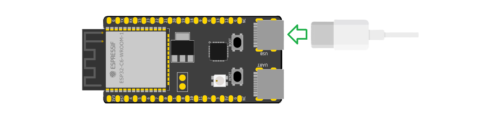
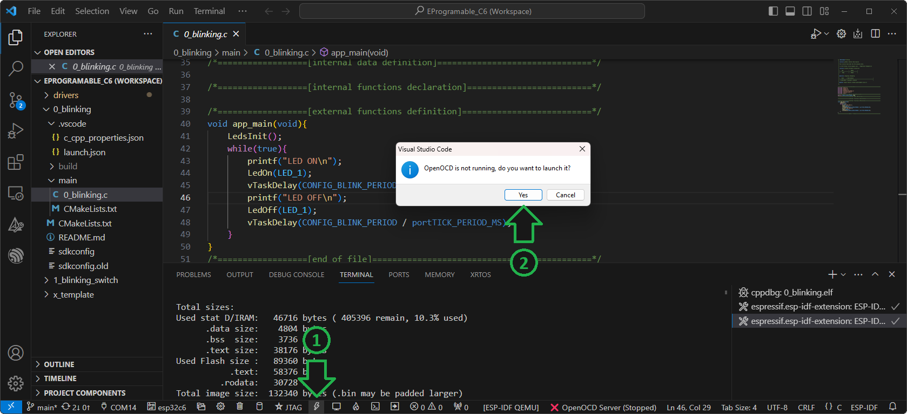
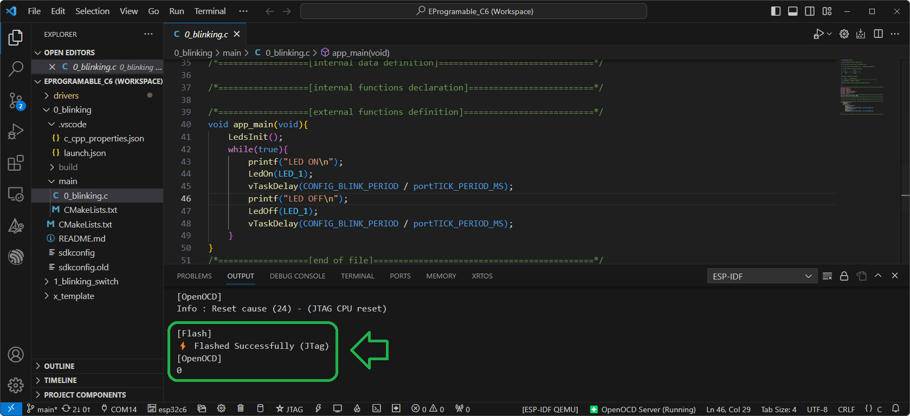
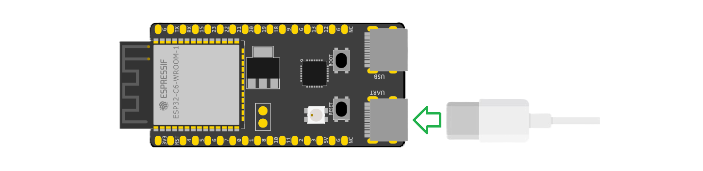
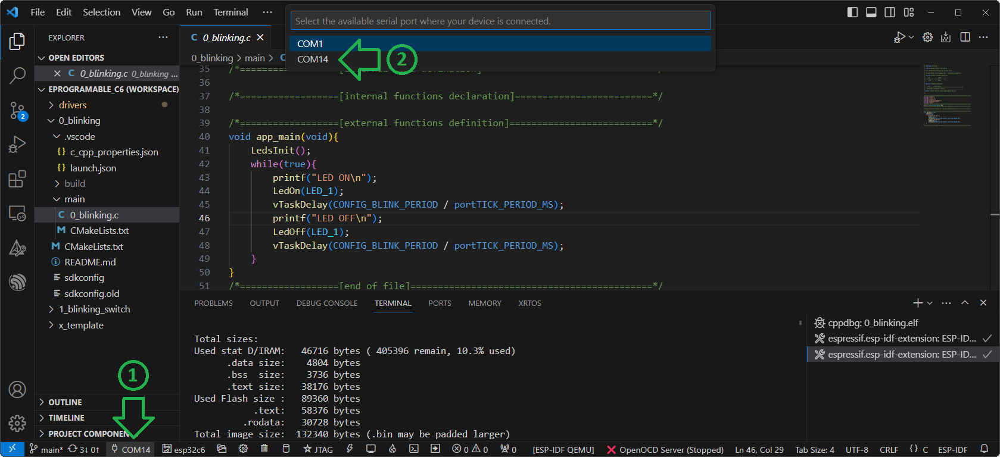
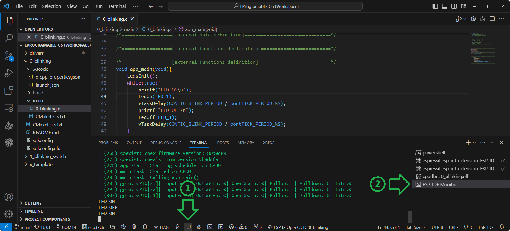

# Grabación y Depuración 

A continuación se detallan los pasos para la grabación de la placa ESP32-C6-DevKitC-1 con un programa compilado, y para el manejo de las herramientas depuración.

1. [Grabación](#Grabación)
2. [Depuración](#Depuración)
3. [Monitor Serie](#Monitor-Serie)

## Grabación

1. Conecte la placa ESP32-C6-DevKitC-1 a su computadora utilizando un cable USB-C en el conector señalado como `USB`.

    
	
2. Presione el botón `ESP-IDF Flash Device`. La primera vez que realice la grabación le aparecerá una ventana prguntando si desea lanzar OpenOCD, presione `Yes`.
 
    
	
3. El programa comenzará con la grabación del microcontrolador. 
Si esta se completa correctamente, podrá observar el mensaje `Flashed Successfully (JTag)` en la pestaña `OUTPUT`.
	
    
	
	Si observa la placa, también podrá observar el parpadeo del LED1.
	
## Depuración
El modo de Depuración (Debug) nos permite correr el código del programa de manera controlada en el microcontrolador, a la vez que se pueden observar los valores de variables y registros. 
Para entrar en modo Depuración se debe:

1. Asegúrese de que OpenOCD esté corriendo.

    
	
    En caso contrario, inícielo presionando en `OpenOCD Server (Stoped)` y luego en `Start OpenOCD`.

    
	
2. Cambie a la vista `Run and Debug` y luego seleccione en el menú desplegable el proyecto sobre el cual realizar debug (en este caso `ESP32 OpenOCD (0_blinking)`).

    

3. Presione el botón `Start Debuging` o `F5`. Una vez iniciado el modo debug se mostrará una nueva barra con botones para el control de la ejecución del programa.

    
	
## Monitor Serie
El `ESP-IDF Monitor` permite imprimir por pantalla mensajes enviados desde el microcontrolador, que pueden ser de utilidad para la verificación del funcionamiento de un programa.
En el mismo se muestran los mensajes enviados utilizando las funciones `printf()` o `ESP_LOG()`. 

1. Conecte la placa ESP32-C6-DevKitC-1 a su computadora utilizando un cable USB-C en el conector señalado como `UART`.

    

2. Seleccione el puerto `COM` correspondiente a la placa.

    > **NOTA:** El número del puerto `COM` es asignado por su sistema operativo al momento de conectar la placa por primera vez, por lo tanto puede variar de un dispositivo a otro. 
    
	

3. Presione el botón `ESP-IDF Monitor device`. Se abrirá un nuevo terminal llamado `ESP-IDF monitor` donde se mostrarán los mensajes enviados.
     
	 > **NOTA:** Al ejecutar el `Monitor` el microcontrolador se reinicia, por lo tanto los mensajes mostrados parten desde el inicio de la ejecución del programa grabado.
    
    